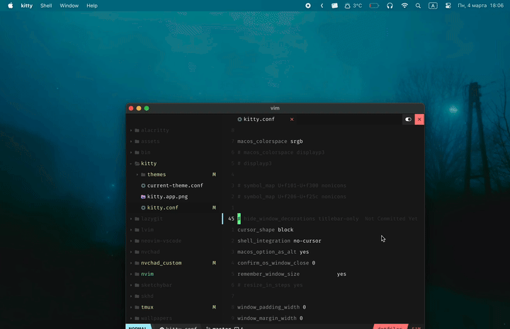
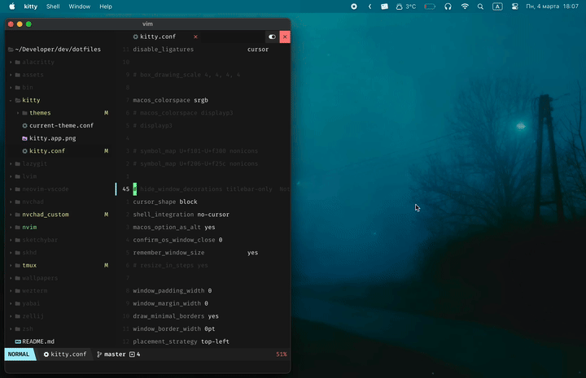
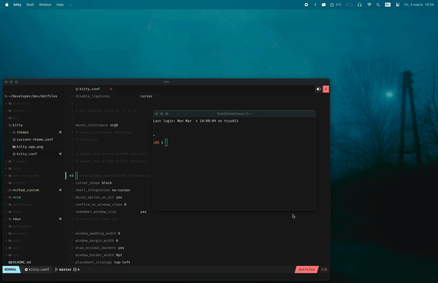

# Snap App - Window Manager for Mac

Snap is the ultimate window manager tool tailor-made for your Mac. Say goodbye to cluttered screens and hello to a streamlined workflow. Utilize Snap to maximize productivity and increase efficiency.

Visit the website [here](https://freethinkel.dev/apps/snap/).

## Fancy Zones

Customize your workspace by creating window layouts for effective multitasking.

## Snapping

Quickly and easily arrange your windows side by side, in corners, or maximize them with precision.

## Shortcuts

Utilize simple shortcuts to move active windows across your screen. Snap's intuitive interface means you spend less time adjusting windows and more time focusing on what matters.

## Autoarrange Windows

Keep your screen organized with automatic window arrangement.

## Installation

[Download](https://freethinkel.dev/apps/snap/) the latest version of Snap from the official website.
